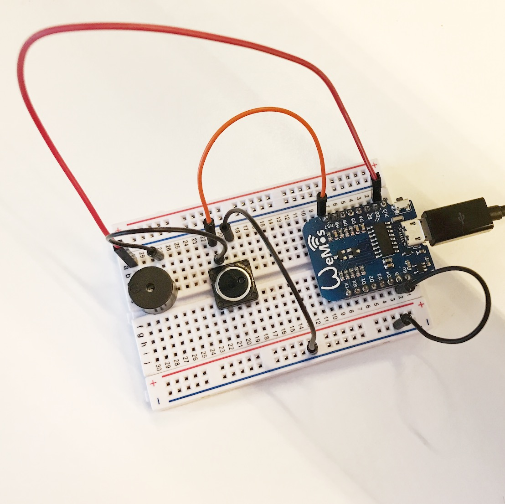
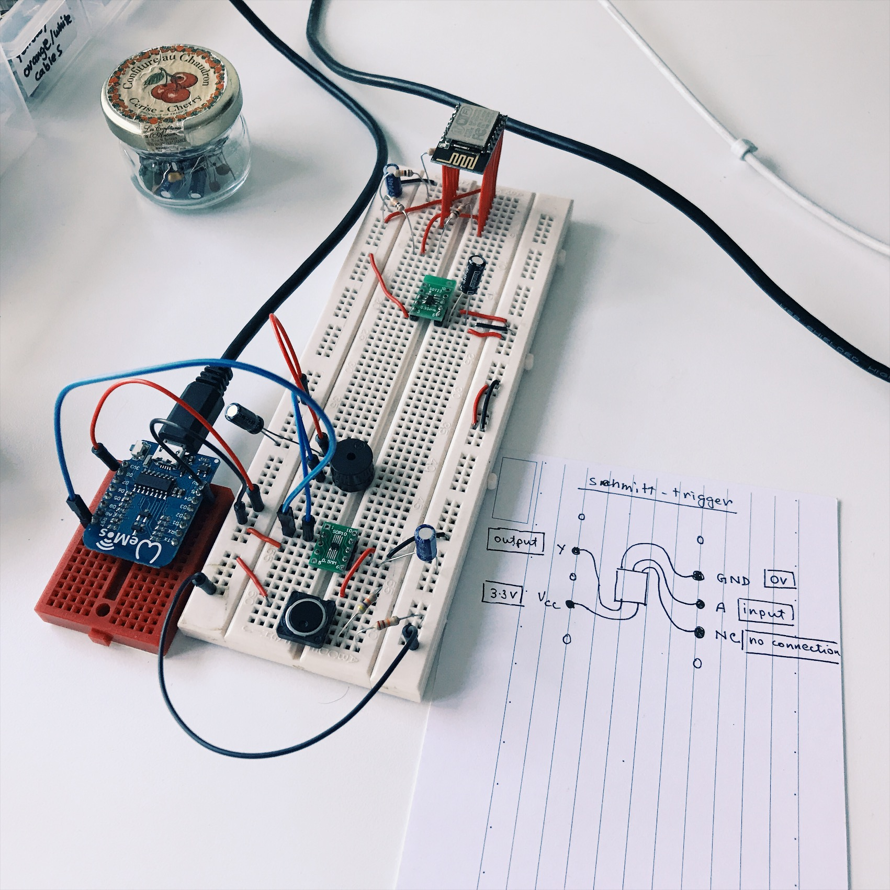
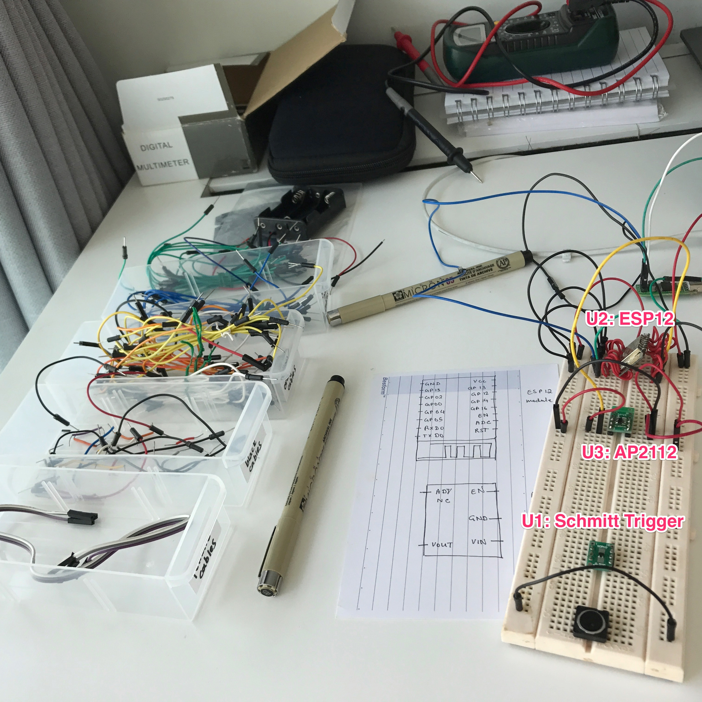

# Prototyping

> Photos of various prototypes

## 1. nodeMCU WeMos



- nodeMCU is used to test the initial circuit
- the circuit has a buzzer and a push button to mimc the bell

## 2. nodeMCU WeMos with Schmitt trigger



- Super simple interrupt from sleep by pressing the bell

    ```c
    void setup() {
      Serial.begin(9600);
      pinMode(BUILTIN_LED, OUTPUT);

      Serial.println('Start');
      Serial.println('Wake up!');
      digitalWrite(BUILTIN_LED, HIGH);
      delay(1000);
      digitalWrite(BUILTIN_LED, LOW);
      delay(1000);
      digitalWrite(BUILTIN_LED, HIGH);
      delay(1000);
      digitalWrite(BUILTIN_LED, LOW);
      delay(1000);
    }

    void loop() {
      Serial.println("Sleeping in.... 3");
      delay(100);
      Serial.println("Sleeping in.... 2");
      delay(100);
      Serial.println("Sleeping in.... 1");
      delay(100);
      ESP.deepSleep(5e6, WAKE_RF_DEFAULT);
    }
    ```
- Connect to WiFi on waking up

    ```c
    #include <ESP8266WiFi.h>

    const char* ssid     = "secret"; // change secret
    const char* password = "secret"; // change secret

    void setup() {
      Serial.begin(115200);
      delay(10);

      Serial.println();
      Serial.println();
      Serial.print("Connecting to ");
      Serial.println(ssid);

      WiFi.begin(ssid, password);

      while (WiFi.status() != WL_CONNECTED) {
        delay(500);
        Serial.print(".");
      }

      Serial.println("");
      Serial.println("WiFi connected");
      Serial.println("IP address: ");
      Serial.println(WiFi.localIP());

      pinMode(LED_BUILTIN, OUTPUT);

      Serial.println('Start');
      Serial.println('Wake up!');
      digitalWrite(BUILTIN_LED, HIGH);
      delay(1000);
      digitalWrite(BUILTIN_LED, LOW);
      delay(1000);
      digitalWrite(BUILTIN_LED, HIGH);
      delay(1000);
      digitalWrite(BUILTIN_LED, LOW);
      delay(1000);
    }

    void loop() {
      Serial.println("Sleeping in.... 3");
      delay(100);
      Serial.println("Sleeping in.... 2");
      delay(100);
      Serial.println("Sleeping in.... 1");
      delay(100);
      ESP.deepSleep(5e6, WAKE_RF_DEFAULT);
    }
    ```
- Create a HTTP POST request to IFTTT

    ```c
    #include <ESP8266WiFi.h>

    const char* ssid     = "secret"; // change secret
    const char* password = "secret"; // change secret

    void setup() {
      Serial.begin(115200);
      delay(10);

      Serial.println();
      Serial.println();
      Serial.print("Connecting to ");
      Serial.println(ssid);

      WiFi.begin(ssid, password);

      while (WiFi.status() != WL_CONNECTED) {
        delay(500);
        Serial.print(".");
      }

      Serial.println("");
      Serial.println("WiFi connected");
      Serial.println("IP address: ");
      Serial.println(WiFi.localIP());

      pinMode(LED_BUILTIN, OUTPUT);

      Serial.println('Start');
      Serial.println('Wake up!');
      digitalWrite(BUILTIN_LED, HIGH);
      delay(1000);
      digitalWrite(BUILTIN_LED, LOW);
      delay(1000);
      digitalWrite(BUILTIN_LED, HIGH);
      delay(1000);
      digitalWrite(BUILTIN_LED, LOW);
      delay(1000);
      notifyBellPressed();
    }

    void loop() {
      Serial.println("Sleeping in.... 3");
      delay(100);
      Serial.println("Sleeping in.... 2");
      delay(100);
      Serial.println("Sleeping in.... 1");
      delay(100);
      ESP.deepSleep(5e6, WAKE_RF_DEFAULT);
    }

    void notifyBellPressed() {
      WiFiClientSecure client;

      if (!client.connect("maker.ifttt.com", 443)) {
        Serial.println("connection failed");
        return;
      }

      String PostData="sample";

      // Amend "{secret}" to IFTTT web request URL
      client.println("POST /trigger/bell_pressed/with/key/{secret} HTTP/1.1");
      client.println("Host:  maker.ifttt.com");
      client.println("User-Agent: nodeMCU/1.0");
      client.println("Connection: close");
      client.println("Content-Type: text/html; charset=utf-8;");
      client.print("Content-Length: ");
      client.println(PostData.length());
      client.println();
      client.println(PostData);

      return;
    }
    ```

## 3. ESP12

- Refactored to use ESP12 modules for ESP8266
- Also AP2112 is used for the voltage conversion from `5V` to `3.3V`

    
