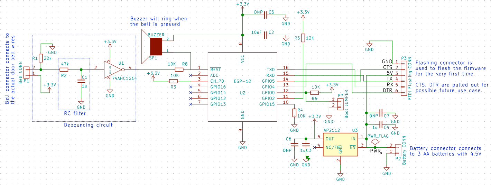
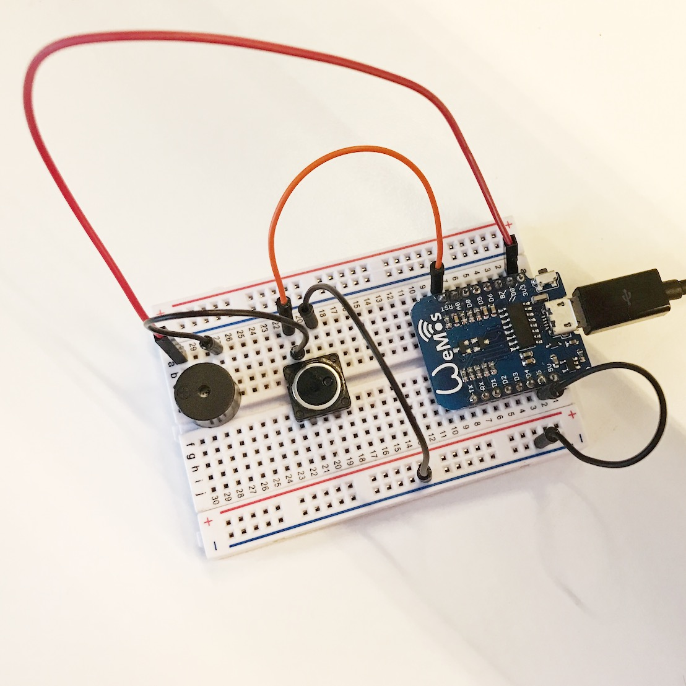

# 🛎 belle

> Door bell with a buzzer and notification to IFTTT.

## Manufacture

1. Open [hardware](hardware) with [KiCad](http://kicad-pcb.org/)
1. Buy [Bill of Materials](https://docs.google.com/spreadsheets/d/1m9wsQ8mQkDeZknwRr8GEDQU02FGcmrBqXRizbyn6Ccs/pubhtml)

## Getting started

1. Assemble the test hardware in a breadboard with [nodeMCU](http://nodemcu.com/index_en.html), button and buzzer

  
1. Configure IFTTT with [Maker](https://ifttt.com/maker) and [Notification](https://ifttt.com/if_notifications) channels to Receive a web request
1. Download the IFTTT app on mobile as well.
1. Amend `Line 220` in [firmware code](firmware/belle.ino#L220) to add the web request URL
1. Load the [firmware code](firmware/belle.ino) in Arduino IDE and upload to nodeMCU
1. For first time, connect to access point with SSID `Belle XXXX` and password `beautyandthebeast`
1. Put in your WiFi SSID and password
1. Press the 🛎. You should hear the buzzer and get a mobile notification as well.

## Modes

### ESP8266 in flashing mode

[[Ref](https://raw.githubusercontent.com/nodemcu/nodemcu-devkit/master/Documents/NODEMCU_DEVKIT_SCH.png)] Connect the pins to:

1. `GND` to `0V`
1. `GPIO0` to `0V`
1. `GPIO15` to `0V`
1. `GPIORX` to TX on serial
1. `GPIOTX` to RX on serial
1. `VCC` to `3V3`
1. `CHPD` to `3V3`

## References

1. [Power Saving tips for the ESP8266](https://github.com/z2amiller/sensorboard/blob/master/PowerSaving.md)
1. [SparkFun 3.3V Step-Up Breakout - NCP1402](https://www.sparkfun.com/products/10967)
1. [Sleeping the ESP8266](http://www.esp8266.com/wiki/doku.php?id=esp8266_power_usage)
1. [Reddit: How to actually run an ESP8266 for months on AA batteries](https://www.reddit.com/r/esp8266/comments/4gmkfl/how_to_actually_run_an_esp8266_for_months_on_aa/)
1. [Battery Powered ESP8266 IoT – Temperature Sensor](http://homecircuits.eu/blog/battery-powered-esp8266-iot-logger/)
1. [ESP8266 Sensor runs 17 days on a coin cell](https://www.youtube.com/watch?v=IYuYTfO6iOs)
1. [wifiwebservers - ESP8266 with 2AA batteries](http://www.arduinesp.com/wifiwebserver)
1. [Simple Authentication](https://github.com/esp8266/Arduino/blob/4897e0006b5b0123a2fa31f67b14a3fff65ce561/libraries/ESP8266WebServer/examples/SimpleAuthentification/SimpleAuthentification.ino)
1. [Debouncing circuit](http://www.ganssle.com/debouncing-pt2.htm)

## Tools

1. [simple calculator for estimating a (LiPo) battery's life](http://battery-life.of-things.de/battery-life-calculator.php)
1. [Encode to Base64 format](https://www.base64encode.org/)
1. [Electronics circuit simulator](http://www.falstad.com/circuit/)

## Credits

:star: Big thanks to [Chinmay](https://chinmay.audio/), [Adnan](https://github.com/catmaker), [Kenneth](https://github.com/kennethlimcp), [Shan](https://twitter.com/shannietron), [Baoshi](https://twitter.com/ba0sh1) for prototyping, feedback, verifications and soldering :star:
