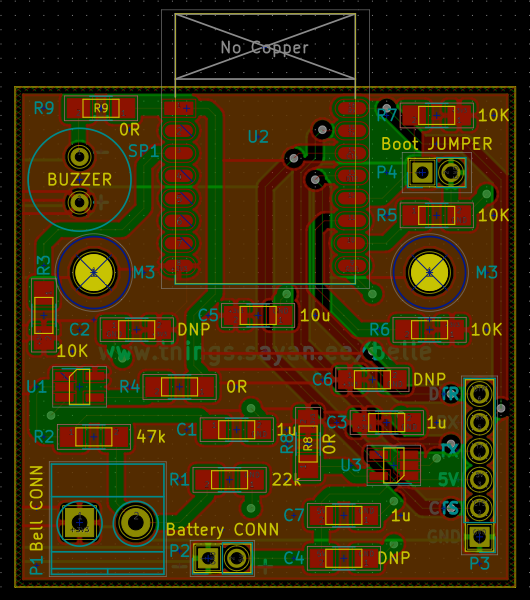
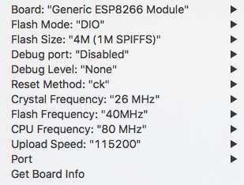

# 🛎 belle

> Door bell with a buzzer and notification to IFTTT.

## Manufacture

1. Open [hardware](hardware) with [KiCad](http://kicad-pcb.org/)
1. Buy [Bill of Materials](bill_of_materials.csv)

## Getting started

### Flash the firmware

1. Ensure the batteries are not connected yet!
1. Short the 2 header pins on `P4` for boot mode
1. Connect an FTDI chip to `P3`
1. Connect the other end of the FTDI chip to the laptop via USB

    
1. Open Arduino IDE with the following configuration

    
1. Flash the [final firmware](firmware/belle.io) to the board
1. Remove the FTDI chip and the remove the shorted header pins of `P4`

### IFTTT

1. Configure IFTTT with [Webhooks](https://ifttt.com/maker_webhooks) and [Notification](https://ifttt.com/if_notifications) channels to Receive a web request
1. Put the event name as `bell_pressed`
1. Download the IFTTT app on mobile as well
1. Note the IFTTT key [maker_webhooks settings page](https://ifttt.com/services/maker_webhooks/settings)

    

### Connect your door bell

1. Connect 3 AA batteries
1. Connect your actual door bell to `P2` connectors
1. Mount it up on the wall
1. Connect to WiFi access point with SSID `Belle XXXX` and password `beautyandthebeast` on mobile / laptop
1. Visit page <http://belle.local>
1. Fill in SSID, Pass and IFTTT Key
1. Press the 🛎
1. You should hear the buzzer and get a mobile IFTTT notification as well :tada:

## References :books:

### Power savings

1. [Power Saving tips for the ESP8266](https://github.com/z2amiller/sensorboard/blob/master/PowerSaving.md)
1. [SparkFun 3.3V Step-Up Breakout - NCP1402](https://www.sparkfun.com/products/10967)
1. [Sleeping the ESP8266](http://www.esp8266.com/wiki/doku.php?id=esp8266_power_usage)
1. [Reddit: How to actually run an ESP8266 for months on AA batteries](https://www.reddit.com/r/esp8266/comments/4gmkfl/how_to_actually_run_an_esp8266_for_months_on_aa/)
1. [Battery Powered ESP8266 IoT – Temperature Sensor](http://homecircuits.eu/blog/battery-powered-esp8266-iot-logger/)
1. [ESP8266 Sensor runs 17 days on a coin cell](https://www.youtube.com/watch?v=IYuYTfO6iOs)
1. [wifiwebservers - ESP8266 with 2AA batteries](http://www.arduinesp.com/wifiwebserver)
1. [Simple Authentication](https://github.com/esp8266/Arduino/blob/4897e0006b5b0123a2fa31f67b14a3fff65ce561/libraries/ESP8266WebServer/examples/SimpleAuthentification/SimpleAuthentification.ino)
1. [Debouncing circuit](http://www.ganssle.com/debouncing-pt2.htm)

### Flashing

1. [Programming ESP12](http://glyncowles.blogspot.sg/2015/07/programming-and-running-esp12-e.html)
1. [Troubleshooting flashing](https://learn.sparkfun.com/tutorials/esp8266-thing-hookup-guide/discuss#comment-55a05571ce395f88538b4567)
1. [NodeMCU modes](https://raw.githubusercontent.com/nodemcu/nodemcu-devkit/master/Documents/NODEMCU_DEVKIT_SCH.png)

## Tools :radio:

1. [simple calculator for estimating a (LiPo) battery's life](http://battery-life.of-things.de/battery-life-calculator.php)
1. [Encode to Base64 format](https://www.base64encode.org/)
1. [Electronics circuit simulator](http://www.falstad.com/circuit/)
1. [Circuit calculator](http://circuitcalculator.com/)

## Credits :pray:

:star: Big thanks to [Chinmay](https://chinmay.audio/), [Adnan](https://github.com/catmaker), [Kenneth](https://github.com/kennethlimcp), [Shan](https://twitter.com/shannietron), [Baoshi](https://twitter.com/ba0sh1) for prototyping, feedback, verifications and soldering :star:
